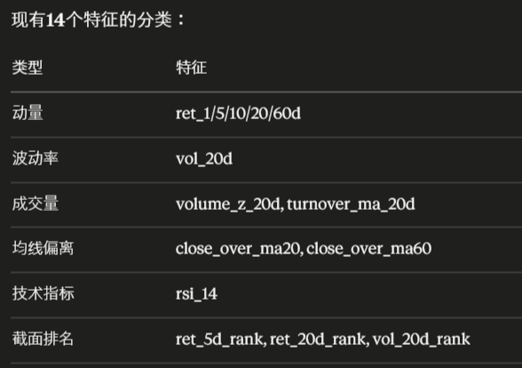

---

## 整体工作流

```
walk_forward_cv.py   → 调参/选特征（只用 2026-02-01 之前的数据）
baseline_xgboost.py  → 生成提交文件（用全部数据，5月3日前更新一次）
test set 评估         → 只在最后写报告时跑一次（TEST_START = 2026-02-01）
```

**Test set 原则**：只能跑一次，跑之前必须锁定模型。跑完后的数字是最终报告数字，不能再调参重跑。

---

## 评分规则

| 权重 | 部分 | 评分标准 |
|------|------|----------|
| 40% | 报告 | 方法/实验/结论 |
| 25% | 自测 | 测试集 IC 超过 baseline |
| **30%** | **5月11-15日实盘** | **超额收益全班排名** |
| **5%** | **5月6-8日实盘** | **超额收益全班排名** |

实盘35%靠超额收益排名，IC/std 不是直接评分指标。

---

# 4/25 进度总结

## 数据处理改进

**Winsorize + 行业中性化**：每天截面内截断到 ±3σ，再减去申万一级行业均值（31个行业，100%覆盖）。两项合计：mean IC 0.007 → **0.0135**。行业数据由 `fetch_industry.py` 拉取，一次性。

## 超参数调优

| 实验 | depth | mcs | λ | sub/col | Mean IC |
|------|-------|-----|---|---------|---------|
| 原始基准 | 5 | 10 | 1.0 | 0.8/0.8 | 0.0135 |
| A（激进正则）| 3 | 20 | 5.0 | 0.8/0.8 | -0.0036 |
| B（中等） | 4 | 20 | 3.0 | 0.8/0.8 | 0.0096 |
| **C（最优）** | 5 | 20 | 5.0 | **0.6/0.6** | **0.0151** |

降低采样率（0.8→0.6）比减小树深度更有效；depth=3 太浅。

## 新增技术特征（共23个）

新增：`ret_120d`, `vol_ratio_5_20`, `macd_hist`, `bb_position`, `bb_width`, `dist_52w_high`, `dist_52w_low` + 对应 rank

**结果（23特征 + C参数）：Mean IC = 0.0170，Std = 0.028**（W2/W3 的负 IC 从 -0.05 收窄到 -0.01）

---

# 4/26 进度总结

## PE/PB 数据获取

放弃 baostock（连接超时），改用 `ak.stock_zh_valuation_baidu`：
- 499只股票全部成功，耗时约9分钟，PE/PB 非空率 100%
- 文件：`data/fundamentals.parquet`，支持断点续传

## 特征实验对比

| 实验 | 特征数 | Mean IC | 结论 |
|------|--------|---------|------|
| 23技术特征（基准）| 23 | 0.0170 | 基准 |
| **+PE/PB（M2最优）**| **27** | **0.0189** | **保留** |
| 只用PB | 25 | 0.0082 | 比基准差 |
| +Amihud 非流动性 | 29 | 0.0096 | 与市值高度相关，无增量 |
| +ROE 季报 | 29 | -0.0083 | 64.8%非空率，丢弃35%训练数据 |
| +市场状态特征 | 30 | 0.0034 | 截面同值，ConstantInputWarning |

W2/W3（2025年9-11月）始终负IC：PBOC放水流动性驱动大涨，价值因子失效，市场结构问题。

**结论：27特征（+PE/PB）为 XGBoost 最优，Mean IC = 0.0189（M2）**

---

# 4/29 进度总结

## LightGBM + num_leaves 调参

XGBoost → LightGBM（leaf-wise生长）。在499只股票小截面上，默认 `num_leaves=31` 过拟合，扫描4~31后：

| num_leaves | 结果 |
|---|---|
| 4 | 欠拟合，IC偏低 |
| **8** | **最优，选定** |
| 16~20 | 略低于8 |
| 31（默认）| 过拟合，IC下降 |

**参数对齐修复**：发现 walk_forward_cv.py 默认参数（reg_lambda=1.0, subsample=0.8）与 baseline_xgboost.py（5.0, 0.6）不一致，已修正。

## 新数据：主力资金流向（失败）

`ak.stock_individual_fund_flow` 逐股拉取：499只中只成功41只，其余全被东方财富 IP 封锁。覆盖率 3.1%，弃用，文件重命名为 `_northbound_insufficient.parquet`。

## 新数据：融资融券（成功）

`fetch_margin.py` 按日期批量拉取（SZSE + SSE），不逐股请求，不限速：
- 318个交易日，0失败，955,460行，**覆盖率 97.3%**
- 文件：`data/margin.parquet`，支持断点续传

新增特征（features.py 扩至31个）：
- `margin_buy_ratio`：今日融资买入 / 5日均值（>1=加速加杠杆）
- `margin_bal_chg`：融资余额日变化率（正=加杠杆，负=去杠杆）
- 以及对应截面排名 ×2

CV 结果：Mean IC 0.0150 → **0.0162**（轻微提升）

## 四版模型对比

### CV IC

所有 CV 实验均在 TEST_START（2026-02-01）之前的数据上跑，每个窗口21天。

| 版本 | 特征数 | 模型 | 5窗口 Mean IC | 10窗口 Mean IC |
|---|---|---|---|---|
| M1 教师原始 | 14 | XGBoost 默认 | ≈0.013 | — |
| **M2 最优XGBoost** | 27 | XGBoost 调参+PE/PB+行业中性 | **0.0189** | — |
| M3 初始LightGBM | 27 | LightGBM num_leaves=31 | 0.0141 | — |
| M4 当前版本 | 31 | LightGBM num_leaves=8 + margin | 0.0162 | **-0.0023** |

**10窗口结果解读**（4/29补测，M4）：10个窗口中W1-W3因训练数据不足被跳过，实际跑了6个。新增的早期窗口 W4（7-8月）IC = -0.0753，大幅拖累均值。说明5窗口只覆盖了近期较好的行情（2025年9月-2026年1月），10窗口暴露了模型在更早波动期（2025年7-8月）的脆弱性。

| 窗口 | 验证期 | M4 IC |
|---|---|---|
| W4 | 2025-07-29 → 08-26 | -0.0753 |
| W5 | 2025-08-27 → 09-24 | +0.0393 |
| W6 | 2025-09-25 → 10-31 | +0.0158 |
| W7 | 2025-11-03 → 12-01 | -0.0407 |
| W8 | 2025-12-02 → 12-30 | -0.0043 |
| W9 | 2025-12-31 → 2026-01-30 | +0.0511 |

### 近期实盘（4/22-4/28，5个交易日）

| 版本 | Val IC（最近10天）| 超额收益 |
|---|---|---|
| **M1 教师原始** | 0.1713 | **+1.592%** |
| M2 最优XGBoost | 0.1407 | +0.175% |
| M3 初始LightGBM | 0.1259 | +0.329% |
| M4 当前版本 | 0.0636 | **-2.083%** |

M4近期差的原因：margin_buy_ratio 倾向选加杠杆股票，大盘下跌时被强制平仓。CV IC（长期）→ M2最优；近期实盘 → M1最优；M4两个维度均非最优。

**待问老师**：Self-test 的 baseline 具体是什么（教师原始代码 IC，还是固定阈值）？这决定用哪个模型跑 self-test。

## 当前代码状态

| 文件 | 状态 |
|---|---|
| `features.py` | 31个特征，含 margin_buy_ratio/chg 及排名 |
| `baseline_xgboost.py` | LightGBM，num_leaves=8，加载 margin |
| `walk_forward_cv.py` | 参数已与 baseline 对齐，加载 margin |
| `fetch_margin.py` | 新增，支持断点续传 |
| `data/margin.parquet` | 已生成，955,460行，97.3%覆盖率 |
| `submission.csv` | M4配置，as of 2026-04-28，通过格式验证 |

## Strategy Layer 实验（4/30）

模型层（M4）不变，改变 score → weights 的映射方式，4/22-4/28 回测（CSI500 = -0.802%）：

| 方案 | 超额收益 | 说明 |
|---|---|---|
| M4 top50 rank（原始）| -2.083% | 基准 |
| M4 top30 rank | -2.082% | 与 top50 几乎一样（选股高度重叠）|
| M4 top50 exp权重（α=3）| -1.262% | 小幅改善 |
| M4 top30 exp权重 | -1.680% | — |
| M4 top50 margin过滤10% | -2.322% | 过滤高融资股，反而更差 |
| **ensemble top50** | **-0.852%** | **最佳：LightGBM + XGBoost 50/50 rank 融合** |
| ensemble top30 | -1.005% | — |

**关键结论**：根本问题在模型选股方向（M4 偏向高杠杆股），strategy layer 只能缓解。Ensemble 最有效，因为 XGBoost 副模型不使用 margin 特征，混合后稀释了高杠杆偏好。

**新增命令行参数**（`baseline_xgboost.py`）：
```bash
--weight-scheme exp    # 指数权重（放大高分差距，默认 rank）
--exp-alpha 3.0        # 指数集中度（默认 3，建议范围 1~5）
--margin-filter 0.1    # 过滤融资杠杆最高10%（默认 0=不过滤）
--ensemble             # LightGBM + XGBoost 双模型融合
```

---

---

# 4/30 调整方向建议

## 问题诊断

之前调参方式不够严谨：特征、模型、参数经常同时改，无法判断哪个变量起作用；也没有在跑实验前预测结果方向。

## LA 建议的推进顺序

1. **先 XGBoost，调参到满意**
2. **再 LightGBM，调参到满意**
3. **扩展数据（2025年以前的历史数据）**
4. **研究 ensemble**
5. **对比选择最终模型**

## 参数调优方法论

- **控制变量**：每次只改一个参数，其他全部固定
- **跑前先预测**：猜对了说明思路对；猜错了更有价值，说明对这个参数有误解
- **Spreadsheet 驱动**：模板设计好就决定了做什么实验，列包括"本次改的参数、改动前后值、预测方向、实际结果"
- **Performance Drop 有意义**：某方向变差，反方向可能变好；最没信息量的是原地不动

## 各参数的 scale 和扫描范围

### XGBoost（先调）

| 参数 | 作用 | Scale | 建议范围 |
|---|---|---|---|
| `reg_lambda` | L2 正则，越大越保守 | **log** | 0.1, 0.5, 1, 2, 5, 10, 20 |
| `max_depth` | 树深度 | linear | 3, 4, 5, 6 |
| `min_child_weight` | 叶节点最少样本 | **log** | 5, 10, 20, 50 |
| `subsample` | 行采样比例 | linear | 0.5, 0.6, 0.7, 0.8, 1.0 |
| `colsample_bytree` | 列采样比例 | linear | 同上 |
| `learning_rate` | 步长 | **log** | 固定 0.05，靠 early stopping 确定树数 |

**为什么 reg_lambda 是 log scale**：从 0.1→1 和从 10→100 对模型的相对影响差不多（都是 10 倍），线性扫描会在小值区间浪费大量实验。

### LightGBM（XGBoost 调完再做）

| 参数 | 作用 | Scale | 建议范围 |
|---|---|---|---|
| `num_leaves` | leaf-wise 生长关键参数 | log | 4, 8, 16, 31（已知 8 最优）|
| `min_child_samples` | 叶节点最少样本 | **log** | 10, 20, 30, 50 |
| `reg_lambda` | L2 正则 | **log** | 同上 |
| `subsample` / `colsample` | 采样 | linear | 同上 |

## 调参顺序（控制变量）

```
1. 确定 baseline（固定 lr=0.05，early stopping 自动决定树数）
2. 只扫 reg_lambda（log scale 粗网格 → 找区间 → 细化）
3. 固定最优 reg_lambda，扫 max_depth
4. 固定前两步最优值，扫 min_child_weight
5. 固定前三步，扫 subsample / colsample（可联动扫网格）
6. 把所有最优值合并，确认组合效果
```

## 当前 cv_log.csv

`walk_forward_cv.py` 每次运行自动追加一行，已有实验记录可在此查看历史对比。

---

## 5月3日前必做

```bash
# 1. 更新价格数据
python download_data.py --update --end 20260503

# 2. 更新 PE/PB（断点续传）
python fetch_pe_pb_akshare.py

# 3. 更新融资融券（断点续传，只补新日期）
python fetch_margin.py

# 4. 确认模型后生成提交文件（模型待定，--ensemble 可选）
python baseline_xgboost.py --out submission.csv

# 5. 格式检查 + 上传 Gradescope
python validate_submission.py submission.csv
```
